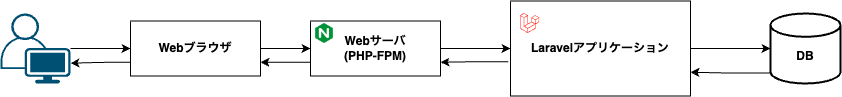
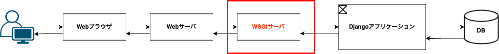

# はじめに

Django に入門していて、WSGI という単語が出てきて困惑したので、自分なりに調べてわかったことを簡単にまとめました。Django や Flask などの python のフレームワークを使った開発をこれから始める方やおさらいしたい方の参考になれば幸いです。

 

# 結論

- 通常の Web サーバ（例: Nginx や Apache）は、直接 Python コードを実行することはできないため、WSGI を介してアプリケーションサーバと連携する
- WSGI の非同期対応版が ASGI サーバ

 

# WSGI とは？

WSGI は Web Server Gateway Interface の略で、**WSGI は、Web サーバと Python アプリケーション間でのリクエストとレスポンスのやりとりを規定する仕様**です。

これだけだと、？？って感じだと思うので、もう少しだけ説明します。

### そもそも Web サーバとアプリケーションサーバとは

Web アプリケーションを作成する時には、通常、Web サーバとアプリケーションサーバが必要です。

AWS にいい記事がありました。

https://aws.amazon.com/jp/compare/the-difference-between-Web-server-and-application-server/

これは Django 以外の何らかのフレームワーク(Rails や Laravel など)でアプリケーションを作成したことがある方には馴染みがあると思います。nginx や apache のことです。ローカルで開発している場合は、`php artisan serve`などで簡易的なサーバを立てているのであまり Web サーバを意識しないかもしれませんが、本番環境ではこの Web サーバが必要になります。

Web アプリケーションの場合、クライアントは、ブラウザから Web サーバにリクエストを送ります。Web サーバはリクエストを受け取ったらさらにアプリケーションサーバに対してリクエストを送ります。アプリケーションサーバはいわゆるバックエンド部分のビジネスロジックだったり DB へのアクセスなどを行い、その結果を Web サーバに返します。Web サーバはその結果をクライアントに返します。

クライアント（ブラウザ）→Web サーバ → アプリケーションサーバ →Web サーバ → クライアント（ブラウザ）って感じです。

クライアントとアプリケーションサーバの間に Web サーバが挟まっているのを見ると、プロキシの構造と似ていると思いますが、実際 Web サーバはプロキシサーバ（リバースプロキシ）としての機能もあります。

 

### WSGI サーバと実行環境

ここまでが、Web サーバとアプリケーションサーバの説明で、ここで WSGI が登場します。
上述したように WSGI は、Web サーバとアプリケーションサーバの間にあり、Web サーバとアプリケーションサーバの間のやりとりを管理するのですが、なぜ WSGI が必要なるのかというと、

**Web サーバは直接 Python コードを実行することができない**からです。実行環境がないという感じです。

ここで自分は「じゃあ Laravel は？」と思ったのですが、Laravel の場合は、Web サーバに PHP-FPM といったものがあり。それを介して PHP を実行することができます。なので、Web サーバとアプリケーションサーバの間には何もなくてもうまくやり取りができるのです。（単語は知っていたがあまり理解していなかった...）

https://www.php.net/manual/ja/install.fpm.php

python の場合は、そのような機能はないので、WSGI を介してアプリケーションサーバと連携することで Python コードを実行することができるのです。

 

https://wsgi.readthedocs.io/en/latest/

とはいっても、WSGI は Django のデフォルトのサーバである `runserver` では使われていない(runserver は開発用サーバ) & 本番環境でもそこまで意識しなくてもアプリケーションを作成できるので、あまり深く考えずに、python を実行するためのものと理解しておけばいいと思います。

ASGI も考え方は同じで、WSGI の非同期対応版です。
ここでは詳しく説明しませんが、気になる方は以下の記事をご覧ください。

https://asgi.readthedocs.io/en/latest/

# まとめ

フレームワークが便利すぎて、WSGI や ASGI を意識しなくてもアプリケーションを作成できてしまうので、ここら辺はおろそかになりがちですが、Django を勉強しているときにやたら出てくるので、おおまかな理解はしておくことは大事かなと思いました。(PHP-FPM も知るいい機会になった)

 

# 参考

https://aws.amazon.com/jp/compare/the-difference-between-Web-server-and-application-server/

https://www.php.net/manual/ja/install.fpm.php

https://wsgi.readthedocs.io/en/latest/

https://asgi.readthedocs.io/en/latest/
